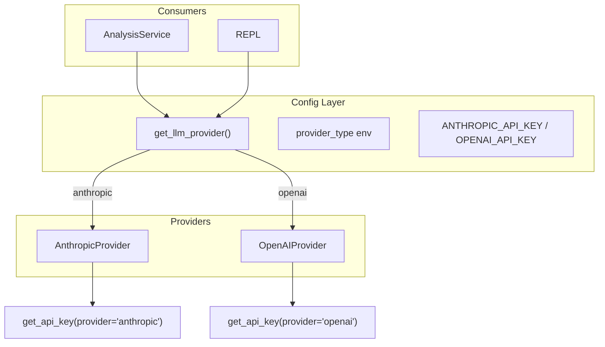

# Add OpenAI API Support

## Current State

The codebase has a clean `LLMProvider` protocol (`[base.py](src/app_strategist/llm/base.py)`) with a single method `complete(system_prompt, messages)`. `AnthropicProvider` implements it, but several places hardcode Anthropic:

- **Config**: `get_api_key()` only reads `ANTHROPIC_API_KEY`
- **Defaults**: `AnalysisService` and REPL in `main.py` both default to `AnthropicProvider()` directly
- **REPL**: Creates `AnthropicProvider()` inline, bypassing any future config
- **Model/tokens**: Per-provider defaults live inside each provider (no shared config)

The protocol and dependency injection in scorers are already provider-agnostic; the gaps are configuration and provider instantiation.

---

## Architecture

---

## Implementation Plan

### 1. Generalize config (`config.py`)

- Add provider-agnostic `get_api_key(provider: str) -> str`:
  - `provider == "anthropic"` → `ANTHROPIC_API_KEY`
  - `provider == "openai"` → `OPENAI_API_KEY`
- Add `get_llm_provider() -> LLMProvider`:
  - Read `LLM_PROVIDER` from env (default: `anthropic`)
  - **CRITICAL: Use lazy imports** — import providers inside the function body (e.g. `from app_strategist.llm import AnthropicProvider`) to avoid circular imports (`config` → `llm` → providers → `config`)
  - Normalize provider name with `.lower()` before comparison
  - **Validate provider name** — if unknown, raise clear `ValueError` (e.g. `"Unknown LLM provider: {name}. Supported: anthropic, openai"`) rather than returning broken objects
  - If `anthropic`: return `AnthropicProvider(api_key=get_api_key("anthropic"), ...)`
  - If `openai`: return `OpenAIProvider(api_key=get_api_key("openai"), ...)`
  - Raise clear `ValueError` for missing API key
- Keep `get_api_key()` with no args as shorthand for Anthropic (or deprecate) to avoid breaking callers; alternatively, have `get_api_key()` accept an optional `provider` and default to `anthropic`.

### 2. Create `OpenAIProvider` (`llm/openai_provider.py`)

- Implement `LLMProvider` protocol with `complete(system_prompt, messages) -> str`
- Use OpenAI Python client: `openai` package (e.g. `openai>=1.0.0`)
- Map the interface:
  - System prompt → first message `{"role": "system", "content": system_prompt}` in `messages` (OpenAI natively supports `role="system"`)
  - Append user/assistant `messages` as-is (roles already compatible)
- Constructor: `model`, `max_tokens`, `api_key` (defaults: e.g. `gpt-4o`, `4096`, `None` → `get_api_key("openai")`)
- Follow same structure as `AnthropicProvider` for consistency

### 3. Update `get_api_key()` usage

- In `AnthropicProvider`: use `get_api_key("anthropic")` when `api_key is None`
- Config module: implement `get_api_key(provider: str)` and optionally a no-arg variant that reads from `LLM_PROVIDER` or defaults to Anthropic for backward compatibility.

### 4. Wire `get_llm_provider()` into consumers

- `**AnalysisService`**: Replace `llm or AnthropicProvider()` with `llm or get_llm_provider()`
- `**main.py`**:
  - Replace `get_api_key()` (Anthropic-only check) with a provider-agnostic check: either call `get_llm_provider()` once (and catch missing-key errors) or add `validate_llm_config()` that ensures the configured provider’s API key is set
  - In `_run_repl()`: replace `AnthropicProvider()` with `get_llm_provider()`

### 5. Remove hardcoded imports where possible

- `main.py`: remove `from app_strategist.llm import AnthropicProvider`; use `from app_strategist.config import get_llm_provider`
- `analysis.py`: remove `from app_strategist.llm import AnthropicProvider`; use `from app_strategist.config import get_llm_provider` for the default

### 6. Dependencies and env

- Add `openai>=1.0.0` to `pyproject.toml`
- Update `.env.example` with `LLM_PROVIDER` and `OPENAI_API_KEY`
- Update `README` with OpenAI setup instructions

### 7. LLM package exports

- Add `OpenAIProvider` to `[llm/__init__.py](src/app_strategist/llm/__init__.py)` `__all__`
- No changes needed to scorers or `LLMProvider` protocol

---

## Implementation Notes

- **CRITICAL — Lazy imports:** `get_llm_provider()` MUST use lazy imports (import providers inside the function body, not at module level) to avoid circular imports: `config` → `llm` → providers → `config`.
- **API key security:** API keys must never be logged, included in exception messages, or hardcoded in source. Use environment variables only; error messages may reference the variable name (e.g. `ANTHROPIC_API_KEY`) but never the value.
- **Fail-fast validation:** `get_api_key()` and `get_llm_provider()` resolve at import or startup. Call validation (e.g. `get_llm_provider()` or a dedicated `validate_llm_config()`) at the start of CLI commands, before heavy work (parsing files, calling APIs), so misconfiguration fails immediately with a clear error.
- **Provider name validation:** Normalize provider names with `.lower()` before comparison. For invalid values, raise a clear `ValueError` (e.g. `"Unknown LLM provider: {name}. Supported: anthropic, openai"`) rather than returning broken or defaulted objects.

---

## File Changes Summary

| File                                                                  | Changes                                                                                |
| --------------------------------------------------------------------- | -------------------------------------------------------------------------------------- |
| `[config.py](src/app_strategist/config.py)`                           | `get_api_key(provider)`, `get_llm_provider()`                                          |
| `[llm/openai_provider.py](src/app_strategist/llm/openai_provider.py)` | New file - `OpenAIProvider`                                                            |
| `[llm/__init__.py](src/app_strategist/llm/__init__.py)`               | Export `OpenAIProvider`                                                                |
| `[main.py](src/app_strategist/main.py)`                               | Use `get_llm_provider()`, provider-agnostic validation, REPL uses `get_llm_provider()` |
| `[services/analysis.py](src/app_strategist/services/analysis.py)`     | Default `llm` via `get_llm_provider()`                                                 |
| `[pyproject.toml](pyproject.toml)`                                    | Add `openai>=1.0.0`                                                                    |
| `[.env.example](.env.example)`                                        | Add `LLM_PROVIDER`, `OPENAI_API_KEY`                                                   |
| `README.md`                                                           | Document OpenAI setup                                                                  |

---

## Optional Enhancements (Out of Scope for Initial Plan)

- Per-provider model/tokens via env (e.g. `OPENAI_MODEL`, `ANTHROPIC_MODEL`)
- Factory/registry pattern for providers if more backends are added later
- Optional-dependency / lean-install setup (see Documentation for Maintainers)

---

## Documentation for Maintainers

### Adding a New Provider

To add a third provider (e.g. Gemini), update these touchpoints:

1. `**config.py`**
  - `get_api_key(provider)` — add mapping for the new provider's env var (e.g. `"gemini"` → `GEMINI_API_KEY`)
  - `get_llm_provider()` — add branch for the new provider; update the `ValueError` message listing supported providers
2. `**llm/`**
  - Create new provider module implementing `LLMProvider` protocol
  - Add to `llm/__init__.py` exports
3. `**pyproject.toml`** — add dependency (or optional dependency group if using optional deps)
4. `**.env.example`** and **README** — document new env vars and setup

### Optional Dependencies / Lean Install (Future)

The initial plan adds `openai` as a core dependency. Future options to consider:

- **Optional dependency groups** — e.g. `[project.optional-dependencies]` with `openai` and `anthropic` as separate groups; require at least one. This lets non-Anthropic users install without Anthropic, and vice versa.
- **Runtime check** — on provider selection, verify the corresponding package is installed and raise a clear error if not, pointing the user to `pip install app-strategist[openai]` (or similar).

### Known Limitations

- **Model names and max_tokens** are not configurable via environment variables in the initial implementation. Each provider uses its own hardcoded defaults (e.g. `gpt-4o`, `claude-sonnet-4-6`). Per-provider env vars (e.g. `OPENAI_MODEL`, `ANTHROPIC_MODEL`, `*_MAX_TOKENS`) are deferred to a later enhancement.

---

## Message Format Compatibility

The `complete(system_prompt, messages)` contract uses `messages` with `role` in `{"user","assistant"}`. Both Anthropic and OpenAI support this. For OpenAI, the system prompt is prepended as `{"role": "system", "content": system_prompt}` before the user/assistant messages.