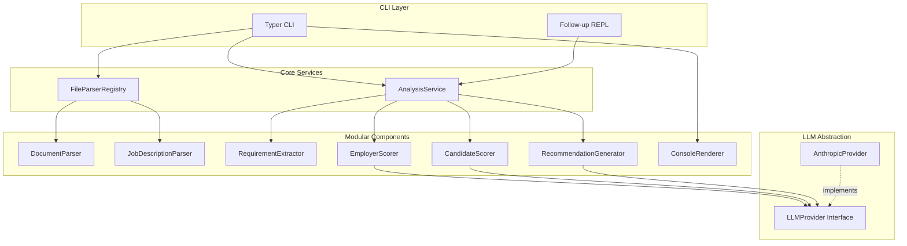

# Job Search Assistance CLI - Implementation Plan (v1)

## Architecture Overview




---

## 1. Project Structure

```
application-strategist/
├── pyproject.toml              # uv-managed, Python 3.11+
├── .env.example                # ANTHROPIC_API_KEY template
├── src/
│   └── app_strategist/
│       ├── __init__.py
│       ├── main.py             # Typer app entry + REPL loop
│       ├── config.py           # Load .env via python-dotenv
│       │
│       ├── llm/                 # LLM abstraction layer
│       │   ├── __init__.py
│       │   ├── base.py         # LLMProvider protocol/ABC
│       │   └── anthropic_provider.py
│       │
│       ├── parsers/             # File parsing (extensible)
│       │   ├── __init__.py
│       │   ├── base.py         # DocumentParser, JobDescriptionParser protocols
│       │   ├── text_parser.py  # .txt, .md implementations
│       │   └── registry.py    # ParserRegistry by extension
│       │
│       ├── models/              # Pydantic v2 structured outputs
│       │   ├── __init__.py
│       │   ├── evaluation.py   # EmployerEvaluation, CandidateEvaluation
│       │   ├── scoring.py     # ScoreComponent, FitScore
│       │   └── session.py     # AnalysisSession (for REPL context)
│       │
│       ├── services/           # Core orchestration
│       │   ├── __init__.py
│       │   ├── analysis.py    # AnalysisService
│       │   ├── requirement_extractor.py
│       │   ├── employer_scorer.py
│       │   └── candidate_scorer.py
│       │
│       └── rendering/          # Console output
│           ├── __init__.py
│           └── console.py      # Rich-based renderer
│
└── tests/
    ├── __init__.py
    ├── conftest.py             # Pytest fixtures
    ├── test_parsers/
    │   ├── test_text_parser.py
    │   └── test_registry.py
    ├── test_models/
    │   └── test_scoring.py
    └── test_services/
        └── test_analysis.py
```

---

## 2. Tech Stack and Dependencies

**pyproject.toml** (uv-managed):

- `python = ">=3.11"`
- `typer[all]` — CLI
- `anthropic` — Claude SDK
- `pydantic >= 2.0`
- `rich` — console rendering
- `python-dotenv` — .env loading
- `pytest` — dev dependency

**API key**: Load from `.env` via `python-dotenv`; fail with a clear error if `ANTHROPIC_API_KEY` is missing.

---

## 3. LLM Provider Abstraction

**Interface** (`llm/base.py`):

```python
from typing import Protocol

class LLMProvider(Protocol):
    def complete(self, system_prompt: str, messages: list[dict]) -> str:
        """Returns assistant text. messages: [{"role": "user"|"assistant", "content": str}, ...]"""
        ...
```

**AnthropicProvider** (`llm/anthropic_provider.py`):

- Uses `anthropic.Anthropic()` (API key from env)
- Model: `claude-sonnet-4-6`
- `complete(system_prompt, messages)` → `client.messages.create(system=..., messages=..., max_tokens=4096)`
- All Anthropic-specific calls live only in this module

**Extensibility**: `OpenAIProvider` (or others) can be added later by implementing the same interface.

---

## 4. File Parsing (Extensible)

**Protocols** (`parsers/base.py`):

- `DocumentParser`: `parse(path: Path) -> str` — resume/cover letter
- `JobDescriptionParser`: `parse(path: Path) -> str` — job description

**Implementations** (`parsers/text_parser.py`):

- `TextDocumentParser`: supports `.txt`, `.md`
- `TextJobDescriptionParser`: supports `.txt`, `.md`

**Registry** (`parsers/registry.py`):

- `DocumentParserRegistry`: maps extensions (`.txt`, `.md`) to parsers; raises clear error for unsupported extensions
- `JobDescriptionParserRegistry`: same pattern
- Future: add `PdfDocumentParser`, `DocxDocumentParser`, `UrlJobDescriptionParser` without changing callers

**Validation**: Check file exists, readable, non-empty; raise descriptive errors.

---

## 5. Pydantic Models (Structured Outputs)

**Employer-side** (`models/evaluation.py`):

- `EmployerEvaluation`: `strengths`, `gaps`, `suggested_improvements`, `wording_suggestions`, `fit_score`, `score_rationale`
- `ScoreComponent`: `name`, `weight`, `score`, `explanation` (for explainable scoring)
- `FitScore`: `value` (0–100), `components: list[ScoreComponent]`

**Candidate-side**:

- `CandidateEvaluation`: `positive_alignments`, `concerns`, `questions_to_ask`, `worker_fit_score`, `score_rationale`

**Session** (`models/session.py`):

- `AnalysisSession`: `resume_content`, `cover_letter_content`, `job_description`, `employer_eval`, `candidate_eval` — full context for REPL

---

## 6. Scoring Rubric (Explainable and Deterministic)

Define explicit weights in code (e.g., in `employer_scorer.py` / `candidate_scorer.py`):

**Employer fit (0–100)** — example weights:

- Skills/experience alignment: 35%
- Keyword/match density: 25%
- Clarity and structure: 20%
- Quantified achievements: 15%
- Tailoring to role: 5%

**Candidate fit (0–100)** — example weights:

- Role clarity: 25%
- Compensation/benefits transparency: 20%
- Work-life balance signals: 15%
- Growth/career path: 20%
- Red-flag absence: 20%

The LLM is prompted to return scores per component; the service validates and aggregates using these fixed weights. No LLM-generated weights.

---

## 7. Analysis Flow

1. **Parse inputs**: Resume/cover letter + job description via registry
2. **Extract requirements**: LLM call to extract key requirements from job description (structured output)
3. **Employer evaluation**: LLM call with rubric; parse into `EmployerEvaluation`
4. **Candidate evaluation**: LLM call with rubric; parse into `CandidateEvaluation`
5. **Render**: Rich panels for each evaluation
6. **REPL**: Loop prompting for follow-up; each message includes full `AnalysisSession` as context

**System prompt constraints** (enforced in prompts, not just docs):

- "Never fabricate qualifications, experience, or achievements. Only suggest improvements based on what is present or clearly inferable."
- "Distinguish: 'present but underemphasized' vs 'missing / not evidenced'."

---

## 8. REPL Design

- After rendering evaluations, prompt: `"Ask a follow-up question (or 'quit' to exit): "`
- Each user message is sent to the LLM with:
  - **System prompt**: Role + constraints + instruction to use provided context
  - **Messages**: 
    - User: Full session (resume, cover letter, job desc, both evaluations) as structured context
    - User: The follow-up question
- Preserve full context on every turn (no summarization)
- Exit on `quit`, `exit`, or Ctrl+C

---

## 9. CLI Interface (Typer)

```bash
app-strategist analyze --resume path/to/resume.md [--cover-letter path/to/cover.md] --job path/to/job.txt
```

- `--resume`: Required; Path (exists, file, readable)
- `--cover-letter`: Optional
- `--job`: Required; Path (exists, file, readable)
- On success: run analysis, render, then enter REPL

---

## 10. Error Handling and Logging

- `logging` with configurable level (e.g., INFO default, DEBUG via `--verbose`)
- Try/except around file I/O, LLM calls, parsing
- User-facing messages via Rich (errors in red)
- Log API/parsing errors; avoid exposing raw API keys or stack traces to users

---

## 11. Testing Strategy

- **Parsers**: Unit tests for `.txt`/`.md` parsing, registry lookup, unsupported extension errors
- **Scoring**: Unit tests for score aggregation from components using fixed weights
- **Models**: Pydantic validation tests
- **AnalysisService**: Mock `LLMProvider` to test orchestration without API calls
- Tests mirror `src/app_strategist/` under `tests/`

---

## 12. Implementation Order

1. Project setup (pyproject.toml, uv, .env.example)
2. LLM abstraction (base + AnthropicProvider)
3. Parser protocols + text parsers + registry
4. Pydantic models
5. Requirement extractor + employer/candidate scorers (with prompts)
6. AnalysisService orchestration
7. Console renderer
8. Typer CLI + REPL
9. Logging and error handling
10. Unit tests

---

## Key Files to Create


| File                                                                                         | Purpose                                        |
| -------------------------------------------------------------------------------------------- | ---------------------------------------------- |
| [pyproject.toml](pyproject.toml)                                                             | uv project, deps, entry point `app-strategist` |
| [src/app_strategist/llm/base.py](src/app_strategist/llm/base.py)                             | LLMProvider protocol                           |
| [src/app_strategist/llm/anthropic_provider.py](src/app_strategist/llm/anthropic_provider.py) | Anthropic implementation                       |
| [src/app_strategist/parsers/base.py](src/app_strategist/parsers/base.py)                     | Parser protocols                               |
| [src/app_strategist/parsers/text_parser.py](src/app_strategist/parsers/text_parser.py)       | .txt/.md parsers                               |
| [src/app_strategist/models/evaluation.py](src/app_strategist/models/evaluation.py)           | Employer/Candidate Pydantic models             |
| [src/app_strategist/services/analysis.py](src/app_strategist/services/analysis.py)           | Main orchestration                             |
| [src/app_strategist/main.py](src/app_strategist/main.py)                                     | Typer app + REPL                               |


